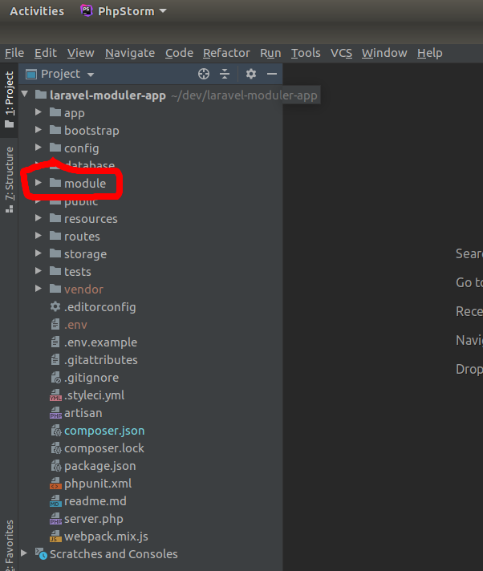
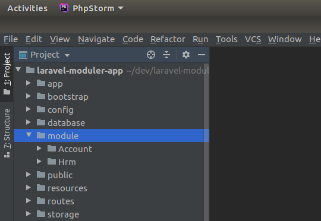
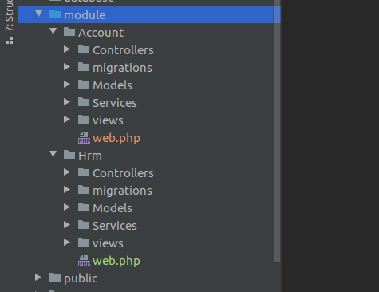
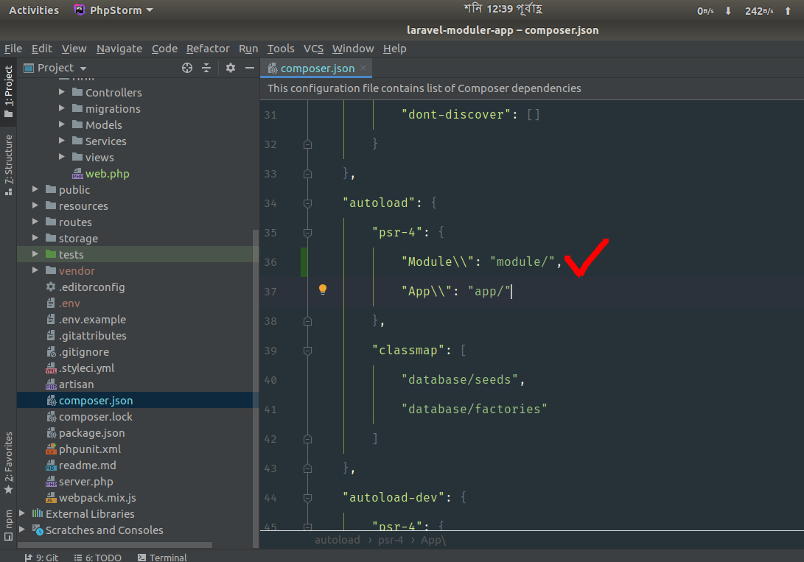
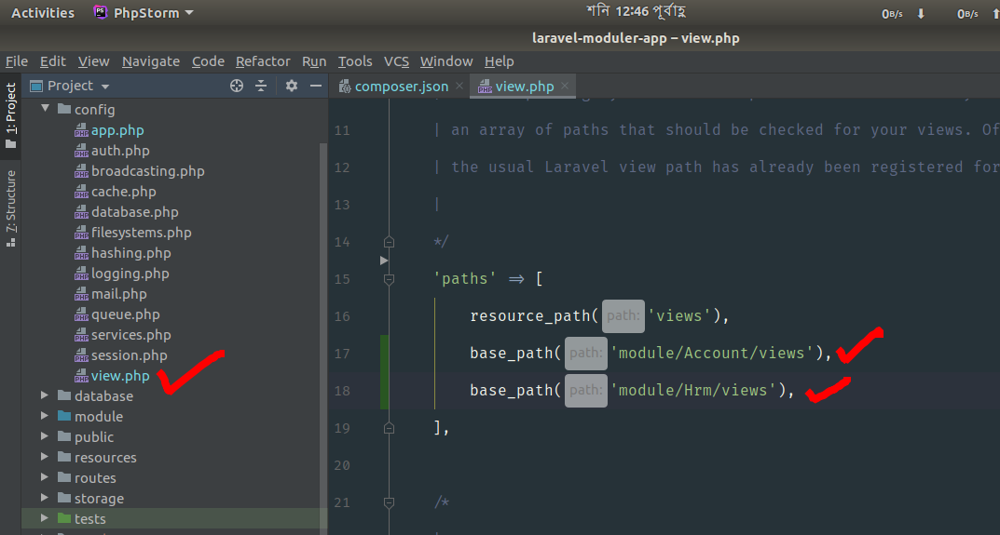
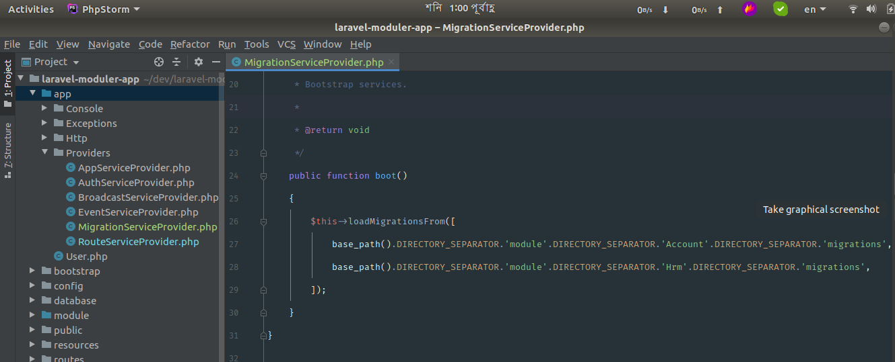
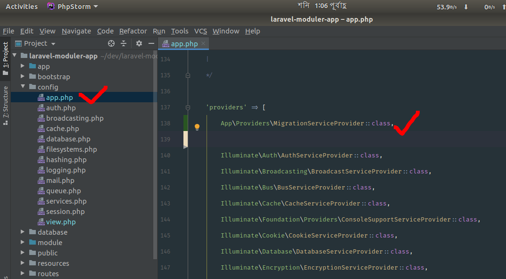

<p align="center"></p>


## Laravel Module Based Application System
You can develop your laravel application based on your module. In this system you can create seperate directory for every module, where every resurses files and folder(like model, view, controller, migrations, and any other classes) will be included in your custom generated folder or directory. Let's see the process step by step.

### In here I will create two module
- Account.
- Hrm.

Listen, my laravel application name is Laravel Moduler App, and the root directory is laravel-moduler-app, So create a directory "module" on the application root directory, like



### Now create two module Account and Hrm, Follow the screenshot



### Create your necessary file and folders, like this




### Now open composer.json and make the changes,
add ```"Module\\": "module/",``` on autoload, like this



### Open config/view.php and add this two line on paths array, followed by screenshot
```php 
        base_path('module/Account/views'),
        base_path('module/Hrm/views'),
```
This code will help you to load your views from your module directory




### Now run a comman ``` php artisan make:provider MigrationServiceProvider```
This command will create a new MigrationServiceProvider. After this command go to ```app/Providers/MigrationServiceProvider.php```
and add this 4 line of code into boot method 
```php 
$this->loadMigrationsFrom([
    base_path().DIRECTORY_SEPARATOR.'module'.DIRECTORY_SEPARATOR.'Account'.DIRECTORY_SEPARATOR.'migrations',
    base_path().DIRECTORY_SEPARATOR.'module'.DIRECTORY_SEPARATOR.'Hrm'.DIRECTORY_SEPARATOR.'migrations',
]);
```



### Now open config/app.php
add ```App\Providers\MigrationServiceProvider::class,``` this line in `providers` array



